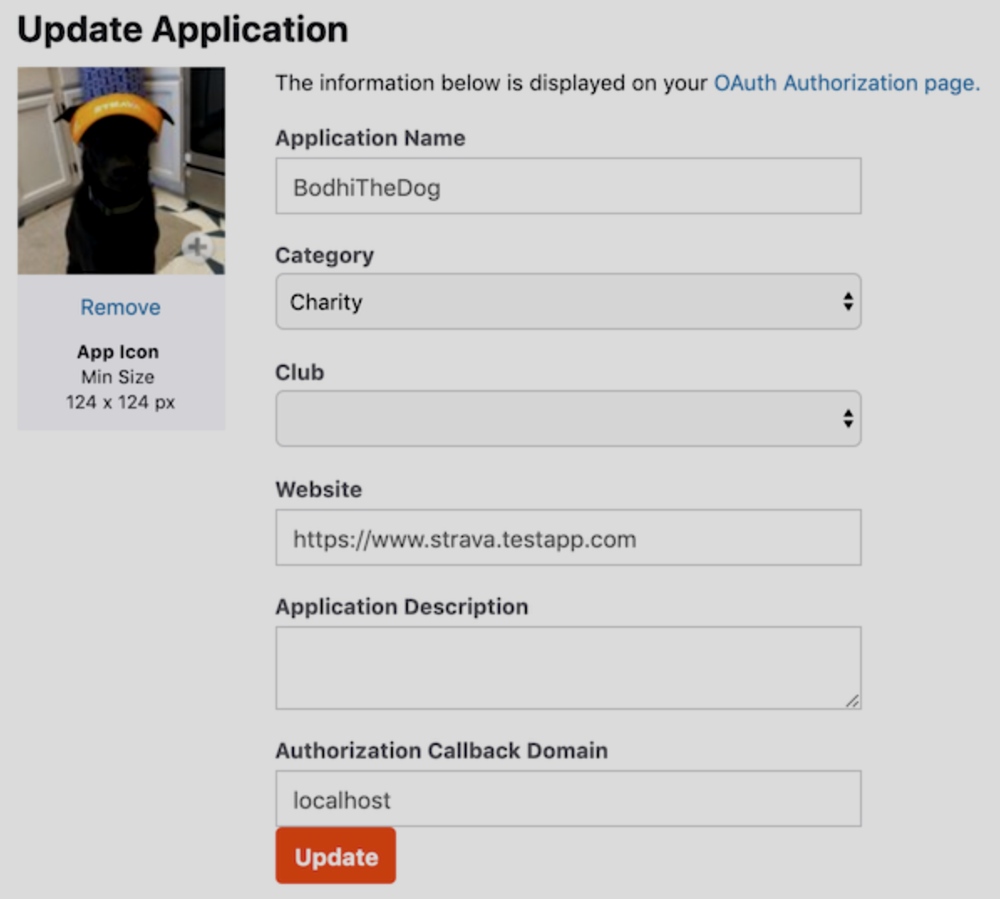
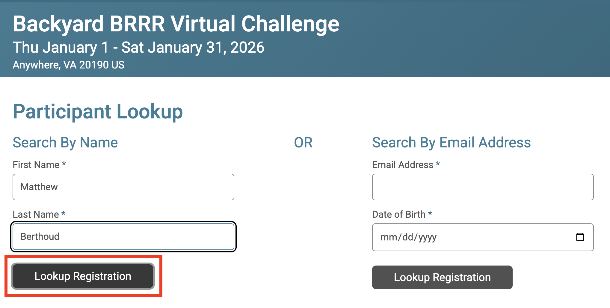
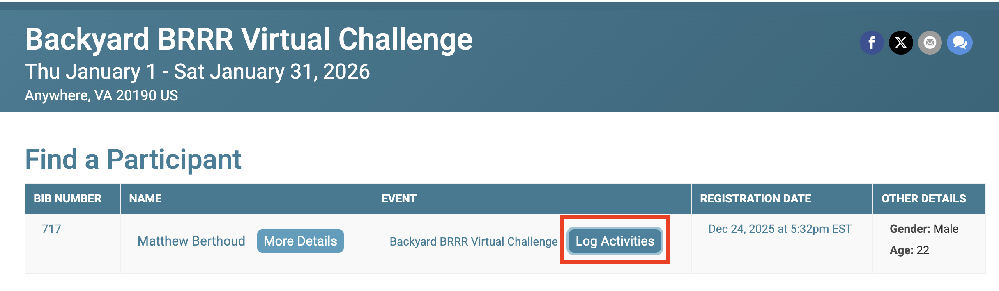
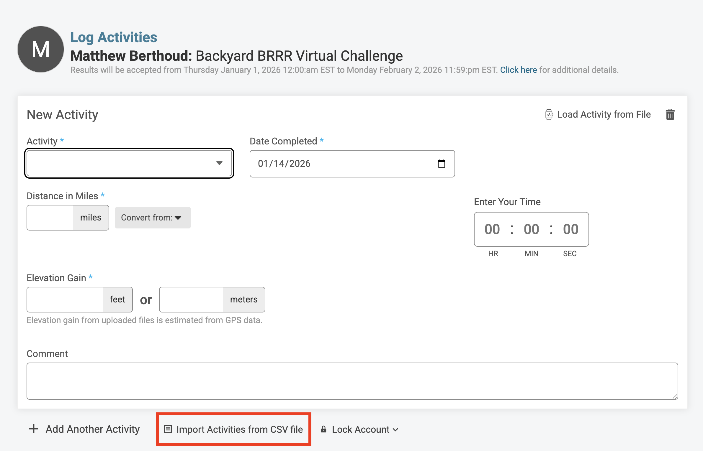

# Backyard Brrr Strava Activity Exporter

This repo helps you quickly import Strava activities into Backyard Brrr.
First you get set up with the Strava API to export your activities, and then you can upload them directly to Backyard Brrr!
Just follow the steps below...

## Prerequisites

- `python`: `brew install pyenv && pyenv install`
- `uv`: `brew install uv`
- Strava Account with activities that you want to upload

## Exporting from Strava

1. Clone the repo:
   ```zsh
   git clone git@github.com:Matthew-Berthoud/strava-brrr.git
   cd strava-brrr
   ```
2. Initialize the project dependencies:
   ```zsh
   uv sync
   ```
3. Set up an application in your Strava account:
   1. Login to your Strava account
   2. Go to settings > My API Application
   3. Create a new application in your account
      
4. Get your client secret and client id for this application, and put them in an `.env` file:
   

   ```sh
   cp .env.example .env
   ```

   1. Now open `.env` and fill in fields

5. Run the script and follow the instructions it prints. You'll only have to do all the Strava setup the _first_ time you use the script. Subsequent uses take mere seconds!
   ```sh
   uv run main.py
   ```
6. Check that `export.csv` has saved to the repo directory.
7. If you have any trouble, open an Issue or Slack message me!

## Uploading to Backyard Brrr

1. Go to the [results page](https://runsignup.com/Race/RegistrationLookup/?raceId=103877&renderMode=results_mode), and search for yourself. 
2. Click Log Activities. 
3. Click Import Activities from CSV. 
4. Upload your generated CSV file!
